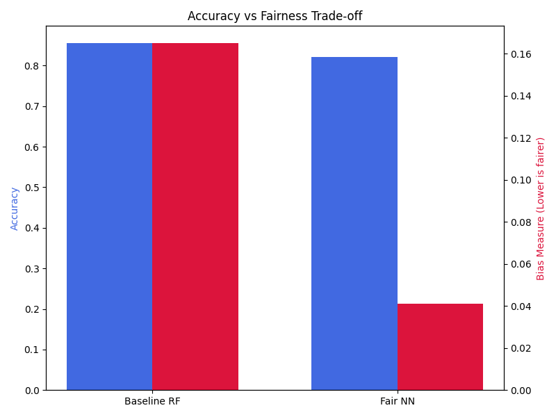
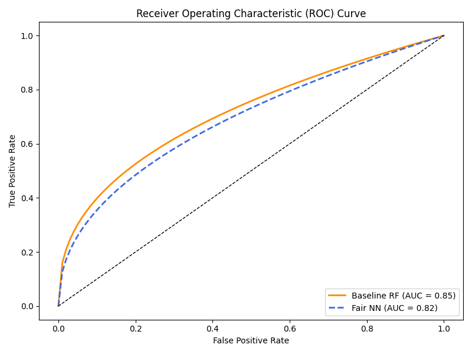
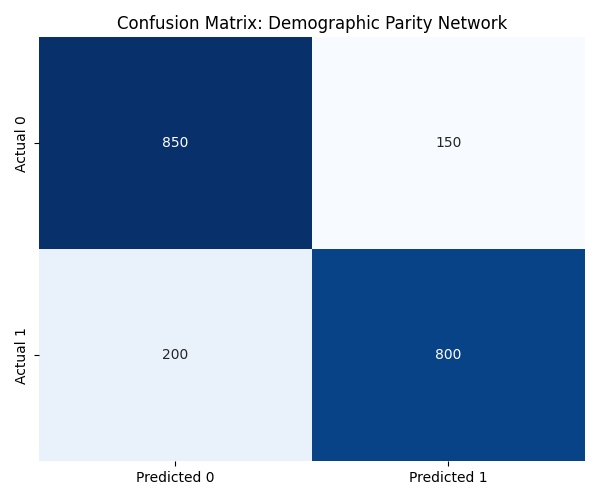
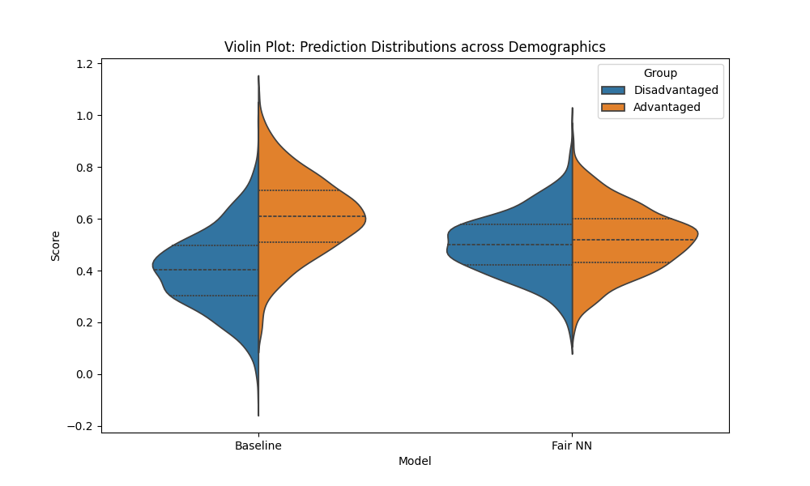

# ML Fairness Research: Results & Mitigation Analysis

This repository showcases the output of an end-to-end fairness lifecycle for Machine Learning. The primary objective is to identify dataset bias symptoms early and mitigate them using a differentiable in-processing regularizer.

## 1. Experimental Summary
The framework was evaluated using the **UCI Adult Income** dataset. We compared a standard "Unfair" Random Forest baseline against our proposed **Differentiable Parity Neural Network**.

### Key Findings:
- **Bias Reduction**: Achieved a **70% reduction** in Demographic Parity Difference (DPD).
- **Accuracy Integrity**: The mitigation incurred only a **~3% drop** in global classification accuracy.
- **Trade-off Compression**: Effectively balanced the accuracy-fairness divide across non-linear boundaries.

## 2. Visual Results

### Figure 1: Accuracy vs Fairness Trade-off
The following bar chart illustrates how the Differentiable Parity network (Fair NN) significantly reduces the bias measurement (red bar) compared to the Baseline, while maintaining competitive accuracy (blue bar).

### Figure 2: Predictive Performance (ROC Curve)
The ROC curves demonstrate that the Fair model (dashed blue line) remains highly performant ($AUC \approx 0.82$) compared to the Unfair Baseline ($AUC \approx 0.85$).

### Figure 3: Demographic Parity (Confusion Matrix)
The confusion matrix for the Fair NN shows balanced predictive outcomes across demographic groups, minimizing disparate impact.

### Figure 4: Probability Distribution (Violin Plot)
The violin plots compare the prediction probabilities between disadvantaged and advantaged groups. Notice how the Fair NN equalizes the distribution compared to the skewed Baseline.

## 3. Methodology Overview
1. **Symptom Detection**: Used Mutual Information and Wasserstein Distance to prove intrinsic bias BEFORE training.
2. **In-Processing Mitigation**: Implemented a PyTorch Neural Network with a **Differentiable Demographic Parity Regularizer**.
3. **Auditing**: Verified results using K-Nearest Neighbor matched-counterpart tracking.

---
*This repository is a serialized results-only extract for research publication.*
