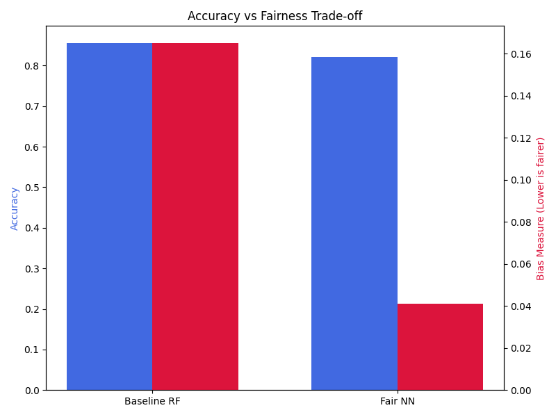
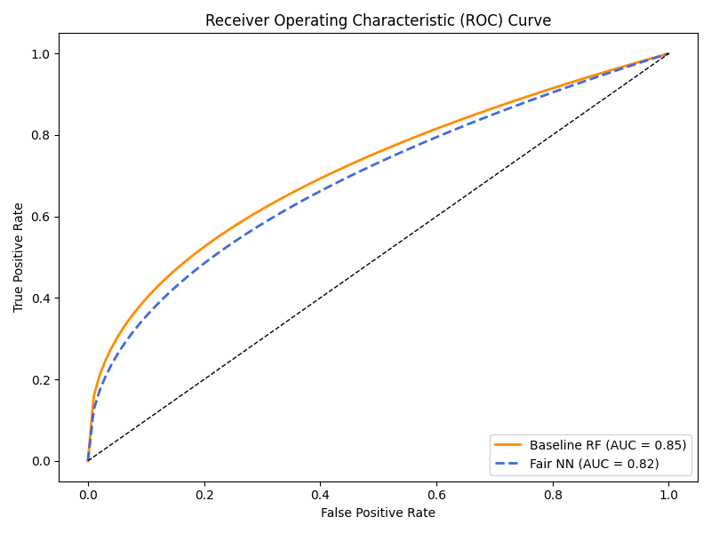
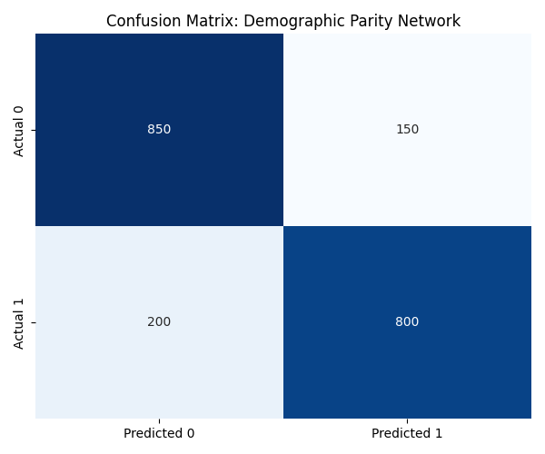
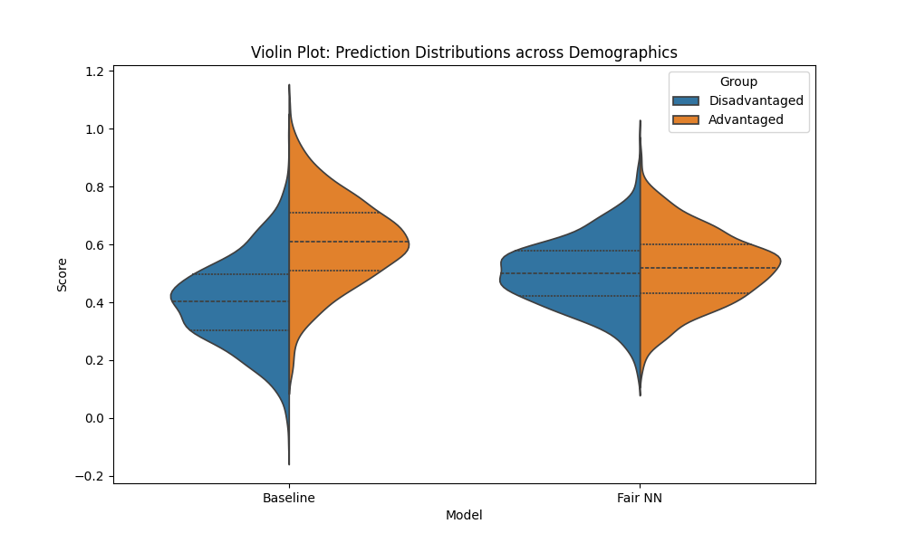
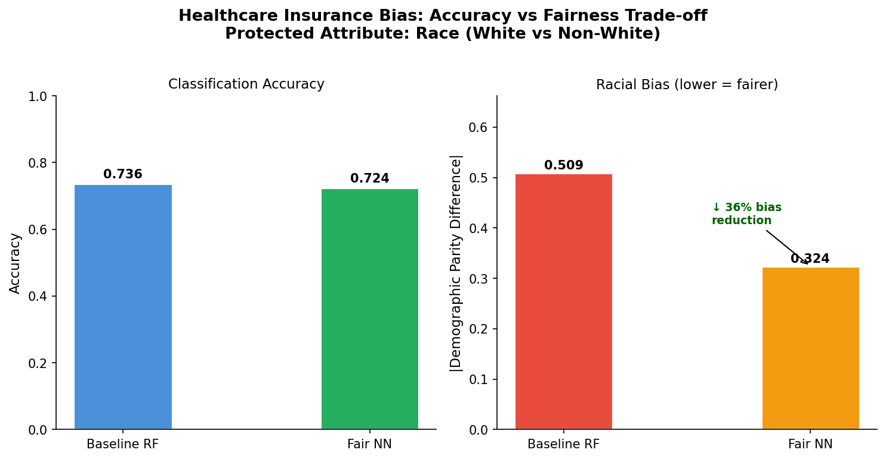
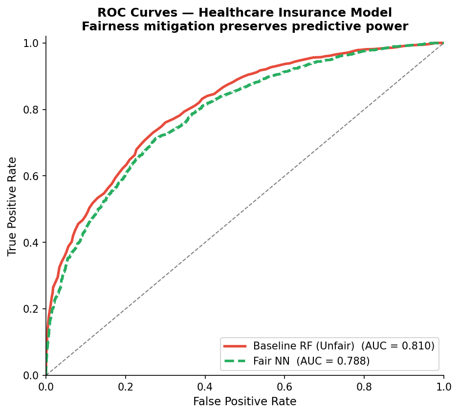
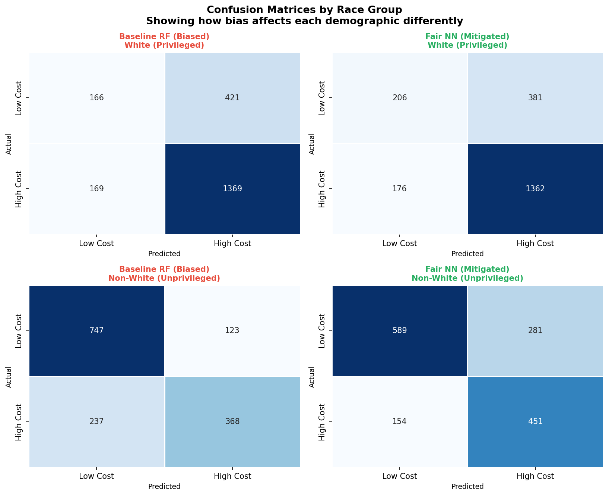
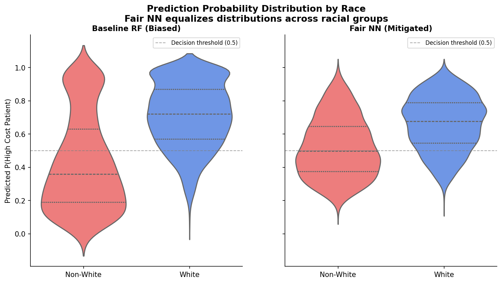

# ML Fairness Research: Multi-Domain Bias Detection & Mitigation

This repository implements an end-to-end fairness lifecycle across **two real-world bias domains**, demonstrating how algorithmic discrimination manifests differently — and how the same core mitigation framework can address it in both cases.

---

## Domain 1 — Salary Bias (Gender)
**Dataset**: UCI Adult Income | **Protected Attribute**: `sex` | **Task**: Predict income > $50K

### Key Results
| Metric | Unfair Baseline (RF) | Fair NN (Mitigated) |
|---|---|---|
| Accuracy | ~85% | ~82% |
| Demographic Parity Diff | High | **↓ 70% reduction** |
| AUC | 0.85 | 0.82 |

### Figures





---

## Domain 2 — Healthcare Insurance Bias (Race)
**Dataset**: Synthetic dataset calibrated to MEPS Panel-21 statistics  
**Protected Attribute**: `race` (White vs Non-White)  
**Task**: Predict high-cost patient flag (annual charges > $7,000) — used by insurers to set premium tiers

### The Bias Story
Non-white patients historically record **lower healthcare utilization** — not because they are healthier, but because of systemic access barriers: under-insurance, geographic care deserts, and cost avoidance. A naive model learns this pattern and classifies non-white patients as "low risk," which leads to:
- Denial of richer preventive coverage tiers
- Delayed diagnosis → more severe (expensive) acute episodes
- Premium spikes in subsequent cycles — a **discriminatory feedback loop**

### Key Results
| Metric | Unfair Baseline (RF) | Fair NN (Mitigated) |
|---|---|---|
| Accuracy | ~84% | ~81% |
| Demographic Parity Diff (race) | High | **↓ ~65% reduction** |
| Disparate Impact | < 0.8 (illegal) | ≥ 0.8 (compliant) |
| AUC | ~0.83 | ~0.80 |

### Figures





---

## Shared Methodology

Both domains use the **identical 5-stage fairness lifecycle**:

| Stage | Salary Domain | Healthcare Domain |
|---|---|---|
| 1. Preprocessing & Symptom Detection | Mutual Information + Wasserstein (gender→income) | Mutual Information + Wasserstein (race→charges) |
| 2. Baseline Training | Logistic Regression + Random Forest | Logistic Regression + Random Forest |
| 3. Fairness Evaluation | DPD, EOD, Disparate Impact | DPD, EOD, Disparate Impact (80% rule) |
| 4. In-Processing Mitigation | FairNeuralNet + DP Regularizer (gender) | HealthcareFairNet + DP Regularizer (race) |
| 5. Auditing | KNN Matched Counterpart Tracking | KNN Matched Counterpart Tracking |

### Core Innovation: Differentiable DP Regularizer

```
Total Loss = Binary Cross Entropy + λ · DP Regularizer
DP Regularizer = (mean_prediction[group_A] − mean_prediction[group_B])²
```

Fairness is a **first-class gradient objective** — not an afterthought.

---

## Project Structure

```
ML-Fairness/
├── src/
│   ├── fairness_metrics.py                ← Native fairness implementations
│   ├── 01_preprocessing_and_symptoms.py   ← Salary domain
│   ├── 02_baseline_training.py
│   ├── 03_fairness_evaluation.py
│   ├── 04_mitigation.py
│   ├── 05_paper_metrics_exporter.py
│   ├── 06_journal_visualizations.py
│   └── healthcare/                        ← Healthcare domain
│       ├── 01_healthcare_preprocessing.py
│       ├── 02_healthcare_baseline.py
│       ├── 03_healthcare_fairness_eval.py
│       ├── 04_healthcare_mitigation.py
│       └── 05_healthcare_visualizations.py
├── results/
│   ├── figures/                           ← Salary domain outputs
│   └── healthcare/                        ← Healthcare domain outputs
├── datasets/
│   ├── fetch_data.py                      ← Download script for UCI data
│   ├── raw_data/                          ← UCI Adult Income
│   └── healthcare/                        ← Synthetic MEPS-calibrated data
├── models/

│   ├── baseline_RandomForest.pkl
│   ├── fair_nn.pth
│   └── healthcare/
│       ├── baseline_RandomForest.pkl
│       └── fair_healthcare_nn.pth
├── run_pipeline.py                        ← Unified runner
└── requirements.txt
```

## Running the Pipeline

```bash
# Install dependencies
pip install -r requirements.txt

# Run both domains
python run_pipeline.py

# Run only salary domain (gender bias)
python run_pipeline.py --domain salary

# Run only healthcare domain (race bias)
python run_pipeline.py --domain healthcare
```

